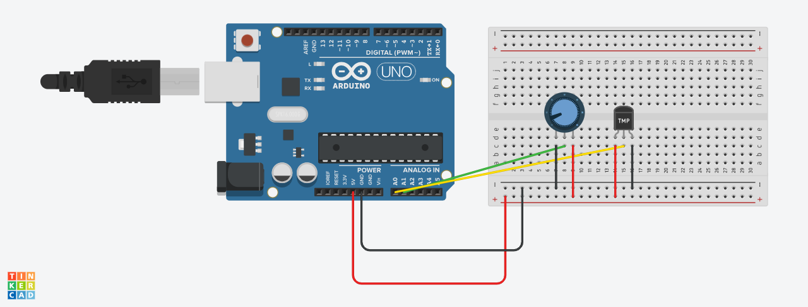

# Documentação Técnica — Estação Meteorológica IoT

---

## Hardware e simulação no Tinkercad

Como o sensor **DHT11** não está disponível no Tinkercad, o circuito foi adaptado:

| Componente original | Substituição | Motivo |
|---|---|---|
| DHT11 (temperatura) | TMP36 | Disponível no Tinkercad |
| DHT11 (umidade) | Potenciômetro | Simula leitura analógica girando o knob |
| BMP180 (pressão) | Omitido | Não disponível; campo salvo como `NULL` |

**TMP36 (pino A0):**
```
temperatura = (tensão_mV - 500) / 10
```

**Potenciômetro (pino A1):** valor 0–1023 mapeado para 0–100% de umidade.

### Conexões

```
TMP36
  VCC → 5V  |  GND → GND  |  OUT → A0

Potenciômetro
  VCC → 5V  |  GND → GND  |  WIPER → A1
```

### Interagindo com a simulação

- **Temperatura:** clique no TMP36 e arraste o slider.
- **Umidade:** gire o potenciômetro.
- O Arduino envia dados a cada 5 segundos via Serial:

```json
{"temperatura": 24.5, "umidade": 63.0}
```



🔗 [Abrir simulação no Tinkercad](https://www.tinkercad.com/things/4htn0NkUu95/editel?returnTo=%2Fdashboard%2Fdesigns%2Fcircuits&sharecode=a-BWQxG1HjJNjC7_MZxRp0oIEzT2DdBmqLwlMPzmfqA)

---

## Dados mockados

Como a integração serial exige Arduino físico, a aplicação usa dados gerados pelo `gerar_dados.py` para demonstração. Ele insere 30 leituras no banco com variação temporal simulada (uma leitura a cada 5 minutos, retroativa):

| Campo | Faixa |
|---|---|
| Temperatura | 18°C – 35°C, variação gradual + ruído |
| Umidade | 30% – 90%, variação gradual + ruído |
| Pressão | `NULL` (sensor omitido) |
| Localização | `'Lab Tinkercad'` |

```bash
cd src
python gerar_dados.py
# ✓ 30 leituras inseridas em dados.db
```

---

## Arquitetura de software

- **Três camadas:** Arduino → Flask API → Interface Web
- **Dois processos paralelos:** `app.py` (servidor) + `serial_reader.py` (leitor serial)
- **WAL mode** no SQLite para escrita simultânea sem deadlock
- Interface em Jinja2 com atualização automática via JavaScript puro
- Gráfico temporal com **Chart.js** via endpoint `/api/leituras/grafico`
- Exclusão e edição via `fetch` (DELETE/PUT) sem recarregar a página

---

## Rotas da API

| Método | Rota | Descrição |
|--------|------|-----------|
| GET | `/` | Painel principal (HTML) |
| GET | `/?formato=json` | Painel em JSON |
| GET | `/leituras` | Histórico paginado (HTML) |
| GET | `/leituras?formato=json` | Histórico em JSON |
| POST | `/leituras` | Cria nova leitura |
| GET | `/leituras/<id>` | Detalhe de uma leitura |
| GET | `/leituras/<id>/editar` | Formulário de edição |
| PUT | `/leituras/<id>` | Atualiza uma leitura |
| DELETE | `/leituras/<id>` | Remove uma leitura |
| GET | `/api/estatisticas` | Média, mín e máx (JSON) |
| GET | `/api/leituras/grafico` | Dados para Chart.js |

### Exemplos curl

```bash
# Criar
curl -X POST http://localhost:5000/leituras \
  -H "Content-Type: application/json" \
  -d '{"temperatura": 24.5, "umidade": 62.0}'

# Atualizar
curl -X PUT http://localhost:5000/leituras/1 \
  -H "Content-Type: application/json" \
  -d '{"temperatura": 25.0, "localizacao": "Sala de Aula"}'

# Deletar
curl -X DELETE http://localhost:5000/leituras/1
```

---

## Leitura serial com Arduino físico

Configure as variáveis de ambiente antes de rodar o `serial_reader.py`:

```bash
# Linux/macOS
export PORTA_SERIAL=/dev/ttyUSB0
export BAUD_RATE=9600
export API_URL=http://localhost:5000/leituras

# Windows
set PORTA_SERIAL=COM3
set BAUD_RATE=9600
set API_URL=http://localhost:5000/leituras
```

Em seguida, em um segundo terminal (com o servidor já rodando):

```bash
cd src
python serial_reader.py
```

---

## Referências

- [Flask Documentation](https://flask.palletsprojects.com)
- [PySerial Documentation](https://pyserial.readthedocs.io)
- [SQLite com Python](https://docs.python.org/3/library/sqlite3.html)
- [Chart.js](https://www.chartjs.org)
- [TMP36 Datasheet](https://www.analog.com/media/en/technical-documentation/data-sheets/TMP35_36_37.pdf)
- [Tinkercad](https://www.tinkercad.com)